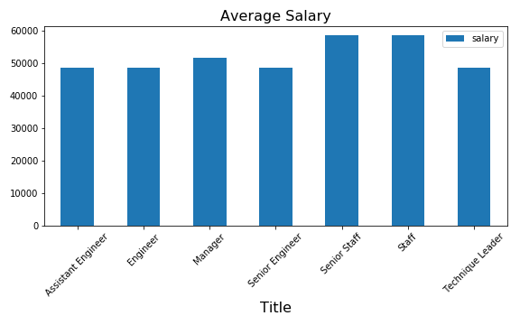

1. Based on the relationship between tables, I firstly used quickdatabasediagrams application (https://app.quickdatabasediagrams.com) to sketch out the diagram of relations between these tables.

2. Save the image into __.png__ file and __Employee.sql__ to import into Postgresql (https://www.postgresql.org).
3. In Postgress, I quiried information using commands in file __queries.sql__.
4. I connected Postgresql to pandas using the code in **employee.ipynb** and analyzed the data for plot a bar chart __"Average Salary"__ to compare the average salary between titles.

