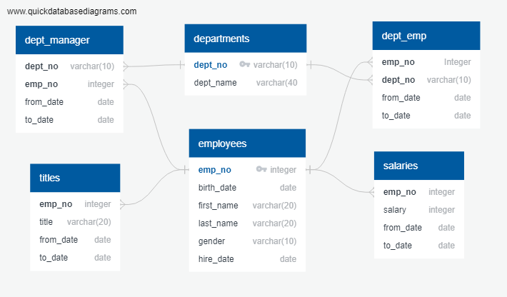

1. Based on the relationship between tables, I firstly used quickdatabasediagrams (https://app.quickdatabasediagrams.com) to sketch out the diagram of relations between these tables.

2. Save the image into png file and Employee.sql to import into Postgresql (https://www.postgresql.org).
3. In Postgress, I quiried information using commands in file queries.sql.
4. I connected Postgresql to pandas using the code in employee.ipynb and analysed the data for plot a bar chart #"Average Salary"# to compare the average salary between titles

